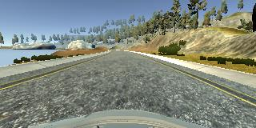
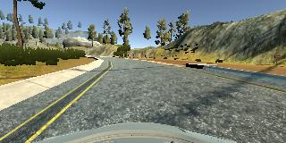
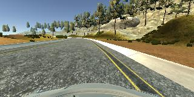
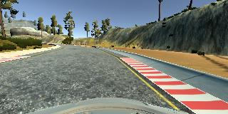

# Project 3 - Behavioral Cloning
## udacity Self-Driving Car Engineer Nanodegree
Use Deep Learning to Clone Driving Behavior

**Behaviroral Cloning Project**

The goals / steps of this project are the following:
* Use the simulator to collect data of good driving behavior
* Build, a convolution neural network in Keras that predicts steering angles from images
* Train and validate the model with a training and validation set
* Test that the model successfully drives around track one without leaving the road
* Summarize the results with a written report

## Rubric Points
###Here I will consider the [rubric points](https://review.udacity.com/#!/rubrics/432/view) individually and describe how I addressed each point in my implementation.

##  Result

The final model can steer the car around the first track successfully, see this [video](https://youtu.be/SET69LtT2f8)

###Files Submitted & Code Quality

####1. Submission includes all required files and can be used to run the simulator in autonomous mode

My project includes the following files:
* model.py containing the script to create and train the model (I worked in my model.ipynb file and then exported it to the model.py file)
* drive.py for driving the car in autonomous mode
* model.h5 and model.json containing a trained convolution neural network
* this README.md summarizing the results

####2. Submssion includes functional code
Using the Udacity provided simulator and my drive.py file, the car can be driven autonomously around the track by executing
```sh
python drive.py model.json
```

####3. Submssion code is usable and readable

The model.py file contains the code for training and saving the convolution neural network. The file shows the pipeline I used for training and validating the model, and it contains comments to explain how the code works.


###Model Architecture and Training Strategy

####1. An appropriate model arcthiecture has been employed

The model that I implemented roughly follows the architecture from the recommended [paper](http://images.nvidia.com/content/tegra/automotive/images/2016/solutions/pdf/end-to-end-dl-using-px.pdf) by Nvidia. However, the layer input sizes are adjusted according to the different image resolution of the images fed into the network. Also, I added additional dropout layers after each of the fully connected layers to prevent overfitting.


Specifically, the layers are configured as follows:

1. Input layer, 3x160x80
2. Normalization layer, 3x160x80
3. 5x5 Convolution, 24 filters, followed by batch normaization & activation
4. 5x5 Convolution, 36 filters, followed by batch normaization & activation
5. 5x5 Convolution, 48 filters, followed by batch normaization, activation & dropout
6. 3x3 Convolution, 64 filters, followed by batch normaization & activation
7. 3x3 Convolution, 64 filters, followed by batch normaization, activation & dropout
8. Fully Connected layer with 1164 units, followed by batch normaization, activation & dropout
9. Fully Connected layer with 100 units, followed by batch normaization, activation & dropout
10. Fully Connected layer with 50 units, followed by batch normaization, activation & dropout
11. Fully Connected layer with 10 units, followed by batch normaization, activation & dropout
12. Output layer, one single unit to output the steering angle

All Convlutional layers use valid padding. Rectilinear Units (relu) are used as activations to introduce nonlinearity and a Keras lambda layer is used for normalization of the data.

####2. Attempts to reduce overfitting in the model

As can be seen above, the model contains several dropout layers as well as batch normalizations to reduce/prevent overfitting to the data.
The model was tested by running it through the simulator and ensuring that the vehicle could stay on the track.

####3. Model parameter tuning

An Adam optimizer is used for optimization and a means squared error (mse) as loss metric.
I first trained the model using a relatively high learning rate of 0.02 for 5 Epochs.
Then I finetuned the model using a much lower learning rate of 0.0001 for another 5 Epochs.
Even though I the optimizer typically takes care of adjusting the learning rate, the significantly lower learning rate passed into the optimizer helped to finetune the model.
The batch size I used for training was 64.

####4. Appropriate training data

Training data was chosen to keep the vehicle driving on the road. I used a combination of centerline driving, recovering from the left and right sides of the road and afterwards balancing the amount of zero-steering angle examples and non-zero steering angle driving. 

For details about how I created the training data, see the next section. 

###Model Architecture and Training Strategy

####1. Solution Design Approach

When designing the model, my first idea was to use a CNN similar to the one employed in the [paper](http://images.nvidia.com/content/tegra/automotive/images/2016/solutions/pdf/end-to-end-dl-using-px.pdf) by nvidia which is referenced in the classroom.
Of course, the sizes of the convolutional layers had to be adjusted to the size of the input layers.
Since I had heard from fellow students from my cohort that it was possible to train the network on downsampled images, I chose a downsampling factor of 2 (320x160 -> 160x80) and adjusted the layers sizes accordingly.
In order to keep training times short / computational requirements low, I decided against including images from the right and left camera. 

The first model I trained seemed to overfit the training data as evidenced by a low training loss and a higher validation loss. So to combat overfitting I added several dropout as well as batch normalization layers to the model and retrained from scratch.

Running the simulator I found that the model performed reasonably well, however, every now and then it would get off track on a straight bit of road where it did not recover appropriately. To improve this particular behaviour, I balanced the distribution of steering angles in the training data (see seciton on Data Collection).

Lastly, I also ran several passes of training with different learning rates passed into the Adam optimizer. The final pass with a very small learning rate really helped the model's driving behaviour to become smoother.

The model trained on this dataset as able to steer the car around the first track successfully, as can seen in this [video](https://youtu.be/SET69LtT2f8)

####2. Final Model Architecture
Please see the section on the final model above.

####3. Creation of the Training Set & Training Process

I split the data in to a training, a validation and a test set according to (.75:.125:.125). (The data was shuffled before splitting into sets).

##### Data Collection

I personally believe the data collection was the most crucial step to success in this project.
I collected data in two ways:

- Centerline Driving: as a baseline, I recorded a few laps of driving with an effort to maintain the car in the center of the lane as much as possible. Here is an example (before downsampling):
 
- Recovery Driving: driving from either the left or the right side of the road back to the center of the road (not recording the inverser direction, i.e. when the car leaves the center of the road). Here are some examples:


recovery driving, left side:



recovery driving, right side: 



recovery driving, right side with red-white markings 




From the recordings, I removed about 70% of the images with a steering angle near zero in order to increase the proportion of images with non-zero steering angles. (I found there to be a relatively narrow balance between keeping to many zero-steering images and retaining to few of these images. Keeping to many zero-steering images led to the vehicle driving off-track in sharper corners more easily, while keeping too few zero-steering images led to the vehicle "bouncing" between the left and right markings. The final dataset consistet of around 50,000 images.


